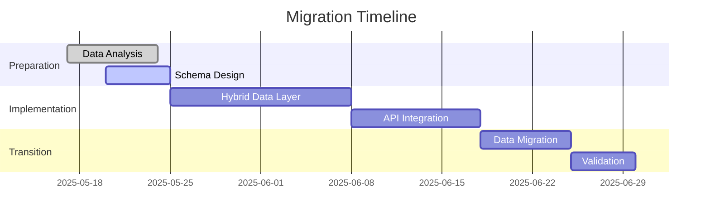

# RamBo Agent: Migration Strategy

## Overview
This document outlines the step-by-step approach to migrate from our current frontend prototype with localStorage to a full-featured, production-grade backend system.

## Migration Phases

### Phase 1: Data Model Alignment (2 weeks)
1. **Audit Current Data Structure**
   - Analyze existing localStorage data schema
   - Map current data models to new PostgreSQL schema
   - Identify any data transformations needed

2. **Create Migration Scripts**
```typescript
// scripts/migrate-localstorage.ts
import fs from 'fs';
import { PrismaClient } from '@prisma/client';

const prisma = new PrismaClient();

async function migrateProjects() {
  const localStorageData = JSON.parse(
    fs.readFileSync('localstorage-backup.json', 'utf-8')
  );

  for (const project of localStorageData.projects) {
    await prisma.project.create({
      data: {
        name: project.name,
        description: project.description,
        status: mapStatus(project.status),
        owner: { connect: { email: project.ownerEmail } },
        tasks: {
          create: project.tasks.map(task => ({
            title: task.title,
            description: task.description,
            status: mapTaskStatus(task.status),
            metadata: task.metadata
          }))
        }
      }
    });
  }
}

function mapStatus(oldStatus) {
  // Conversion logic
}
```

### Phase 2: Dual-Write Implementation (3 weeks)
1. **Implement Hybrid Data Layer**
```typescript
// src/lib/data-service.ts
class DataService {
  constructor(private backendEnabled: boolean) {}

  async saveProject(project) {
    if (this.backendEnabled) {
      try {
        await apiClient.post('/projects', project);
        return;
      } catch (error) {
        console.warn('Falling back to localStorage');
      }
    }
    localStorage.setItem(`project_${project.id}`, JSON.stringify(project));
  }
}
```

2. **Feature Flags for Gradual Rollout**
```typescript
// src/config/feature-flags.ts
export const featureFlags = {
  useBackend: {
    projects: false,
    tasks: false,
    workflows: true,
    agents: false
  }
};
```

### Phase 3: Full Backend Transition (2 weeks)
1. **Final Data Migration**
   - Run comprehensive migration script
   - Validate data integrity
   - Generate migration report

2. **Remove localStorage Dependencies**
   - Update all components to use API exclusively
   - Remove fallback mechanisms
   - Clean up deprecated code

## Rollback Strategy

1. **Database Snapshots**
   ```bash
   # Daily snapshots during migration
   pg_dump -U postgres -d rambo_prod -f backup_$(date +%Y%m%d).sql
   ```

2. **LocalStorage Preservation**
   - Maintain localStorage backups until migration is verified
   - Automatic localStorage backup before migration

## Testing Approach

1. **Validation Tests**
```typescript
// tests/migration.test.ts
describe('Data Migration', () => {
  it('should preserve all projects', async () => {
    const localStorageProjects = getLocalStorageProjects();
    const dbProjects = await prisma.project.findMany();
    expect(dbProjects.length).toEqual(localStorageProjects.length);
  });
});
```

2. **Performance Benchmarking**
   - Compare operation times between localStorage and backend
   - Monitor API response times
   - Test under load

## Migration Timeline



## Risk Mitigation

1. **Data Loss Prevention**
   - Comprehensive backups
   - Dry-run migrations
   - Data validation scripts

2. **Performance Degradation**
   - API response caching
   - Query optimization
   - Load testing

3. **User Impact Minimization**
   - Off-peak migration windows
   - Maintenance mode during critical operations
   - Clear user communication

---

**Note**: This strategy should be reviewed and adjusted as needed during implementation.
