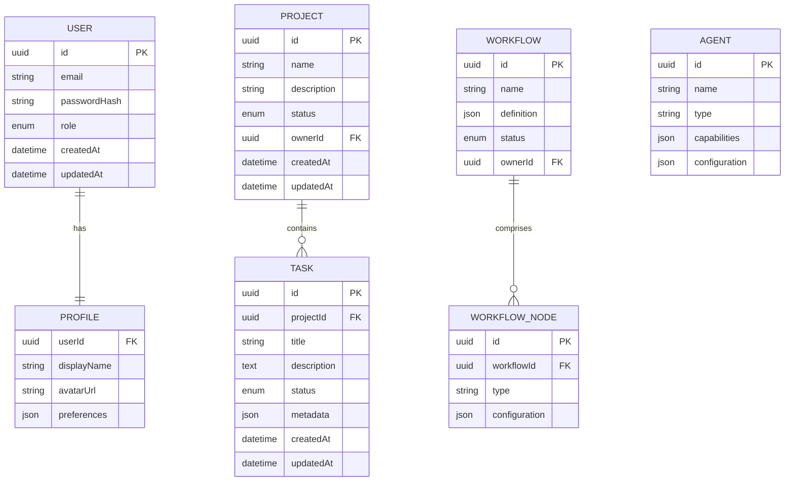
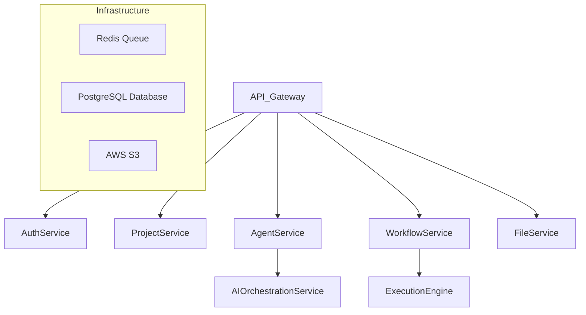

# RamBo Agent: Production Transition Roadmap

## Overview
This document outlines the comprehensive strategy for transitioning our RamBo Agent frontend prototype to a production-grade application.

## I. Backend System & Core Infrastructure

### 1. Database Selection and Schema Design
- **Recommended Database**: PostgreSQL with Prisma ORM
- **Rationale**: 
  - Strong ACID compliance
  - Robust relational data model
  - Excellent scalability
  - Rich ecosystem of tools and extensions

#### Proposed Entity Schemas

### 2. Authentication Strategy
- **Authentication Provider**: Firebase Authentication
- **Features**:
  - Email/Password login
  - OAuth providers (Google, GitHub)
  - Multi-factor authentication
  - Secure password reset
  - Role-based access control

### 3. Backend Technology Stack
- **Framework**: NestJS (Node.js)
- **API Design**: GraphQL with Apollo Server
- **ORM**: Prisma
- **Job Queue**: Bull with Redis
- **Real-time Communication**: Socket.IO
- **File Storage**: AWS S3

### 4. Microservices Architecture

## II. Development Phases

### Phase 1: Foundation (4-6 weeks)
- [ ] Database schema finalization
- [ ] Authentication microservice
- [ ] Basic CRUD API endpoints
- [ ] Initial security hardening
- [ ] Local development environment setup

### Phase 2: Core Features (6-8 weeks)
- [ ] Agent execution engine
- [ ] Workflow processing system
- [ ] Real-time communication
- [ ] Advanced authorization mechanisms

### Phase 3: Production Readiness (4-6 weeks)
- [ ] Comprehensive testing
- [ ] Performance optimization
- [ ] Monitoring and logging
- [ ] CI/CD pipeline configuration

## III. Key Considerations
- Incremental migration from current localStorage approach
- Maintain existing frontend component structure
- Minimize breaking changes
- Robust error handling and logging

## IV. Estimated Timeline
**Total Estimated Duration**: 14-20 weeks
**Estimated Cost**: $150,000 - $250,000

## V. Risks and Mitigation
1. Data Migration
   - Develop robust migration scripts
   - Create backup and rollback strategies

2. Performance Bottlenecks
   - Implement caching mechanisms
   - Use database indexing
   - Conduct regular performance testing

3. Security Vulnerabilities
   - Regular security audits
   - Implement comprehensive input validation
   - Use latest security patches

## Appendix: Recommended Tools
- Monitoring: Datadog, Sentry
- API Documentation: Swagger
- Load Testing: k6
- Security Scanning: Snyk

---

**Note**: This is a living document. Regular updates and team collaboration are crucial for successful implementation.
